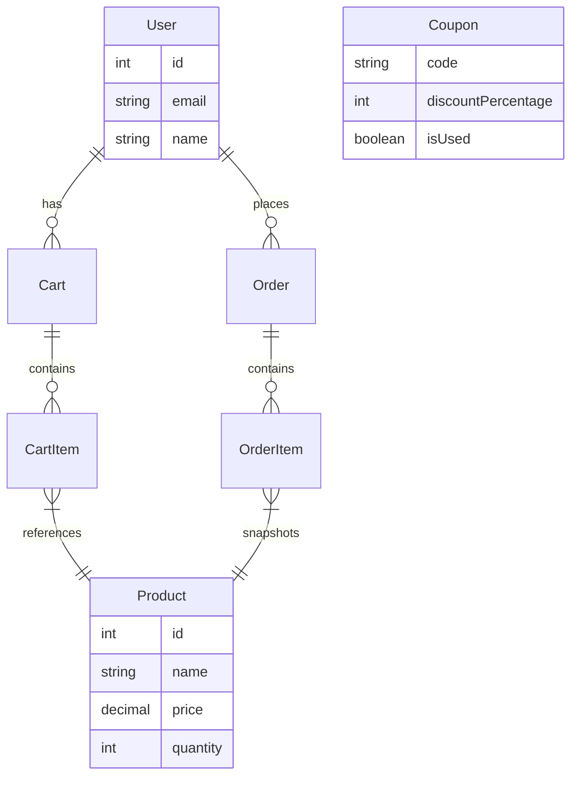

  

<h1 align="center">E-Commerce Backend API</h1>

  A production-ready backend built with <strong>NestJS</strong>, <strong>TypeORM</strong>, and <strong>PostgreSQL</strong>.  
  Fully containerized and optimized for real-world e-commerce workflows.

  
  
  
  
  

---

## 📌 Description

This backend supports the complete lifecycle of an online store—inventory, cart, checkout, analytics, and a unique **Nth Order Coupon System**.  
Everything is fully containerized for easy deployment and development.

---

## 🚀 Key Features

- **🛍 Product & Inventory**  
  Full CRUD with strict stock validation.

- **🛒 Smart Cart System**  
  Real-time quantity checks and persistent carts.

- **📦 ACID-Compliant Checkout**  
  Atomic order creation + stock deduction.

- **🎟 Nth Order Coupon Logic**  
  Auto-generates unique coupons for every Nth user order.

- **📊 Admin Analytics**  
  Secured with `x-admin-api-key`.

- **🐳 Fully Dockerized**  
  Zero-config startup with Docker Compose (dev hot reload supported).

- **✅ CI/CD Ready**  
  GitHub Actions for linting, type-checking, and testing.

---

## 🗄 Database Schema (ER Diagram)

# 🔧 Prerequisites

Ensure the following are installed:

•	Docker & Docker Compose (recommended)

•	Node.js v18+ & npm (optional for local non-Docker dev)

# ⚙️ Environment Setup

Create a .env file in the project root:

# Database
DB_HOST=postgres

DB_PORT=5432

DB_USER=postgres

DB_PASSWORD=password123

DB_NAME=ecommerce_db

# Application
PORT=3000

DISCOUNT_NTH_INTERVAL=5

ADMIN_API_KEY=mySuperSecretKey

# 📦 Project Setup (Local)
npm run docker

npm run start          # development

npm run start:dev      # watch mode

npm run start:prod     # production

# 📚 API Documentation

Swagger UI is available at:

👉 http://localhost:3000/api

